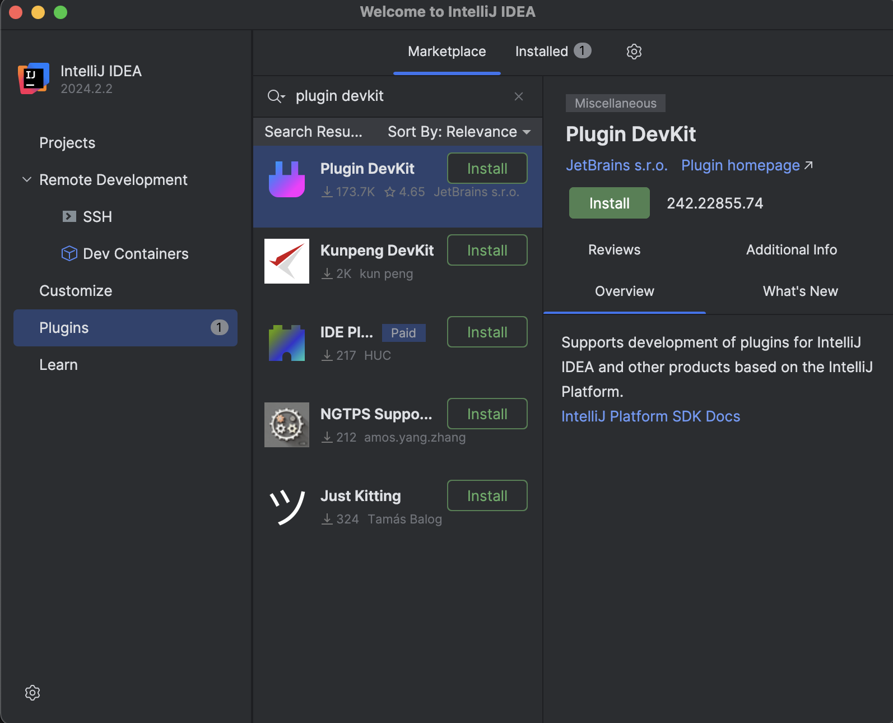
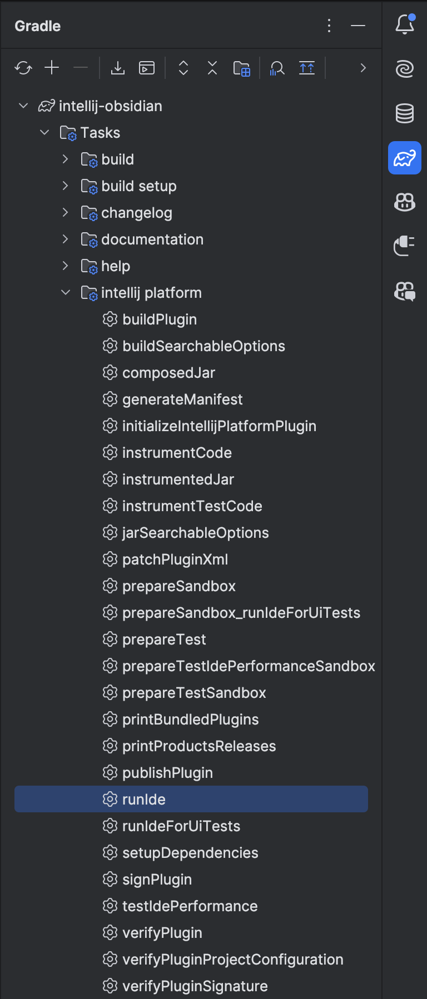

# obsidian-intellij
Intellij Plugin for Obsidian (Code Obfuscation)

## Installation

1. Install [JetBrains IntelliJ IDEA](https://www.jetbrains.com/idea/download)

2. Launch IntelliJ IDEA -> Plugins -> Marketplace -> Search for  `Plugin DevKit` -> Install



## Diary
### MVP
* Created working MVP plugin: replace highlighted java code with obfuscated code (using Obsidian)

Creating the MVP required leveraging the JVM to connect Scala (Obsidian) with Kotlin (IntelliJ Plugin DevKit).

Obsidian has a tokenizer with functions from scalangj `obsidian.lang.java.scalangj` that can be imported by adding the following line to `build.gradle.kts`

```kotlin
repositories {
    maven {
        url = uri("https://raw.githubusercontent.com/obsidian-java/binrepo/master/")
    }
}

...

dependencies {
    implementation("obsidian.lang.java:scalangj_3:0.1.8")
}
```

There lacks a similar set of processes to import the Obfuscation code. Instead to get this done, I copied the Obfuscation code from the [Obsidian repository](https://github.com/obsidian-java/obsidian/tree/master/shared/src/main/scala/obsidian/lang/java) into `src/main/scala/obsidian/lang/java`, starting with a modified `Main.scala` (renamed to `Obsidian.scala`)

`Obsidian.scala` (delta from `Main.scala`)
```scala
object Obsidian {
    def run(cu:CompilationUnit):CompilationUnit = cu match {
    // ...
    }

    // New
    def generateObfuscatedCode(cu: CompilationUnit): String = prettyPrint(run(cu))
}
```

> Required to expose `generateObfuscatedCode` because `Pretty.prettyPrint` is not usable from the scalangj library (at least from Kotlin) due to a language feature (implicit param)

I used sbt to compile the Obsidian code and publish to a **local** ivy repository which has been added to `build.gradle.kts` as a dependency

```kotlin
repositories {
    ivy {
        // Point to the default Ivy local repository location
        url = uri("${System.getProperty("user.home")}/.ivy2/local")

        patternLayout {
            artifact("[organisation]/[module]/[revision]/[type]s/[artifact].[ext]")
            ivy("[organisation]/[module]/[revision]/ivy.xml")
        }
        metadataSources { artifact() }
    }
}
// ...
dependencies {
    implementation("obsidian:obsidian_3:0.1.0") // ensure you have run sbt compile && sbt publishLocal
    implementation("org.typelevel:cats-core_3:2.9.0") // required to run scala!
    testImplementation(libs.junit)
}
```

#### Scala Manual Build command (for now)
`sbt compile && sbt publishLocal`

### Next Steps
* Error logging, test cases, UX experience 
* Remove the need for running the manual sbt compile command for Obsidian *-obfuscate* by hosting the build artifacts publically
* Refactor the two new Obsidian products that have been generated (VSCode && IntelliJ), remove the need to have scala code in both repositories that should be kept in the Obsidian repository (and import Obsidian as a dep in the plugin repos)
    * This approach will help massivley as Obsidian's logic changes and new features are added since updates can just be pushed as a version bump (no code changes in Plugin repos)
    * Also helps with further app development using Obsidian (apps for benchmarks, tests, etc)

### Running
Open the project using IntelliJ IDEA and run the `runIde` task to launch the plugin in a new IntelliJ window
